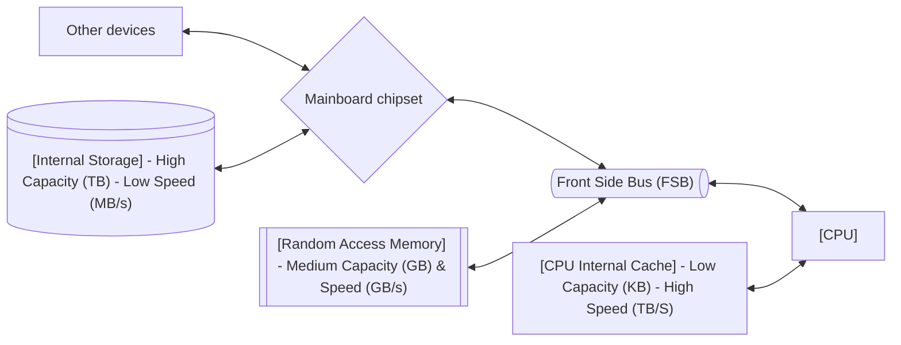
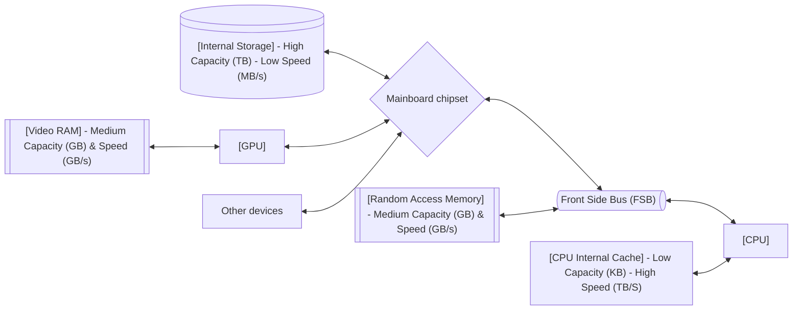
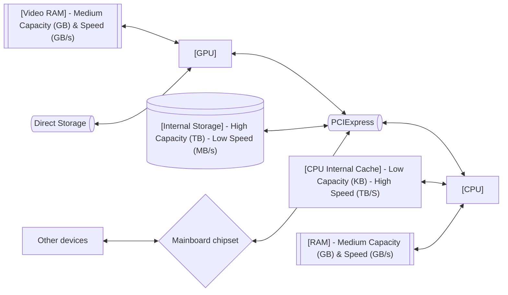
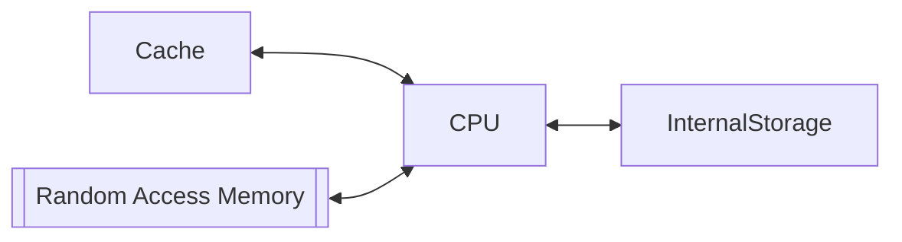
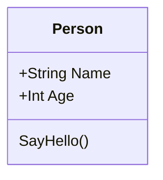
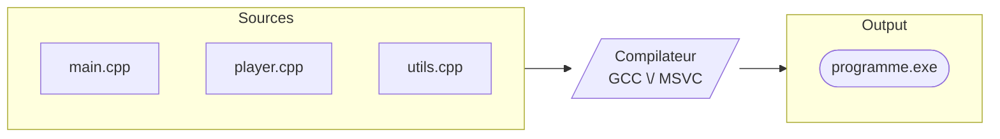

# Intro à la programmation

---

## Notions élémentaires

---

### Le hardware

<br />

#### Principe de base
___

<br />

Avant de commencer, il peut-être utile de s'intéresser au fonctionnement interne du hardware que l'on utilise.

Il est en effet souvent dommage de ne pas utiliser l'outil adapté a une tache précise, ou de mal utiliser l'outil nécessaire...

<br />

<div style="display: flex; justify-content: center; ">

 

</div>

---

Il y a bien longtemps...

<br />

...Nous avons conçu l'architecture interne d'un ordinateur de cette manière...

---

<br />

##### Le duo de base: CPU - RAM
___

<br />

Ou plutôt: Cache - CPU - RAM

<br />



---

Observations
___

<br />

Si on observe un peu, on remarque que:

<br />

**Plus nous somme proche du processeur et plus la vitesse est élevée.**

En contrepartie la capacité est moindre.

<br />

**Plus on s'en éloigne**, plus la capacité augmente...

... mais **la vitesse diminue**.

<br />

Note: *Aussi lors d'un transfert quelconque, la vitesse (bande passante) maximum théoriquement atteignable, ne peut être au mieux, que la vitesse de l'élément le plus lent de la chaÎne. (Canaux de transport compris)*

<div style="display: flex; justify-content: center; ">


</div>


---

De ce fait: 

- Le disque ayant la plus grande capacité, est utilisé pour le stockage, même si il est plus lent.

- Quand les données ont besoin d'être utilisées, le processeur les charge du disque dans la RAM, afin que les données soient disponible.

- Quand le processeur doit effectuer des calculs, si la taille des données n'est pas trop grande, elles peuvent être chargée dans le cache du cpu, là ou elles seront traitées plus rapidement.


---

##### L'arrivée des GPUs
___

<br />

Avec les années et l'arrivée de la 3D, l'accélération matérielle et en particulier, l'accélération 3D est apparue avec la venue des premiers processeurs graphiques externe.

Le CPU n'étant pas adapté pour le calcul en parallèle massif, un nouveau type de processeur à émergé.

<br />

Sans trop rentrer dans le vif du sujet, on notera tout de même la sortie des 3DFX Voodoo 1 et 2 (en 96 et 98)

<br />

Et Nvidia Geforce 256 (en 99), qui fut le premier GPU à supporter l'accélération Transform & Lighting, encore utilisée aujourd'hui.

(Avant cela, ces calculs étaient pris en charge de manière "software" par le CPU.)

<br />

Voir: https://www.hardware.fr/articles/53-3/transformation-lighting-bases.html

---

##### L'ajout du GPU
___

<br />



On notera le "long parcourt" entre le disque, le cpu, la ram, et pour terminer la vram.

---

<br />

<br />

#### Evolution récente
___

<br />



Certains raccourcis on été créé: 

- Le storage a un accès plus direct vers le CPU.
- Une passerelle à été créée entre le storage et le GPU: Microsoft Direct Storage API.

<br />

---

### Low-level VS High-level Languages. 

---
 
<br />

#### Low-Level languages
___

<br />

Initialement, les premiers langages étaient des langages dits "de bas-niveau".

<br />

Leurs fonctionnement utilisent des instructions directes dans un langage proche du langage machine.

<br />

````md magic-move {lines: true}
```asm ts {0|*}
section .data
    ; Définition des données si nécessaire

section .text
global _start

_start:
    mov eax, 5      ; Charge la valeur 5 dans le registre EAX
    add eax, 3      ; Ajoute 3 à EAX (EAX = 8)
    mov ebx, eax    ; Copie le résultat de EAX vers EBX
    mov eax, 1      ; Code d'appel système pour 'exit' sur Linux
    xor ebx, ebx    ; Zéroise EBX (code de sortie normal)
    int 0x80        ; Exécute l'appel système exit`
```

````
*[^1]
[^1]: Un example de code en assembleur.

---

#### Low-Level languages
___

<br />

Ces instructions en général permettent de faire fonctionner le processeur, sa mémoire cache et la mémoire ram du système.

<br />

<div style="display: flex; justify-content: center;">


</div>

- Leur écriture et compréhension est particulièrement difficile, de part leur manque d’abstraction, et du nombre d’instructions parfois nécessaires pour réaliser une simple tâche.

- Ils ont pour avantage d’être extrêmement rapide de part leur lien fort avec le hardware et leur utilité va de pair avec le hardware qui requiert leur utilisation.

---

#### High-Level Languages
___

Les langages de plus haut niveau arrivent ensuite (Ex: C, C++, Pascal, Kobol, Java, etc…).

<br />

```py
# Définition des nombres à additionner
nombre_a = 5                                # Équivalent au 'mov eax, 5' en assembleur
nombre_b = 3                                # Le deuxième opérande

# L'opération elle-même : l'abstraction du processeur
resultat = nombre_a + nombre_b              # Équivalent au 'add eax, 3'

# Affichage du résultat (l'équivalent de notre sortie réussie)
print(f"Le résultat de {nombre_a} + {nombre_b} est : {resultat}")
```
*[^2]
[^2]: Un example de code en python.

<br />

---

#### High-Level Languages
___

<br />

- Ils ont une abstraction plus forte que les langages de bas-niveau et sont généralement plus proche du langage humain (Anglais).
    - Cela améliore drastiquement leur compréhension. 

- Ils disposent de bibliothèques de fonctionnalités, qui comportent beaucoup de fonctions de base et essentielles.

    - Ce qui permet d'éviter de devoir tout réécrire à chaque fois en langage bas niveau.

<br />

Ex: la fonction print() utilisée ici en fin d’exemple…

---

#### Résumé
___

<br />

##### Low-Level Languages

<br />

| Avantages | Inconvénients |
| --------- | ------------- |
| - Rapidité et précision | - Complexité |
| - Lien fort avec hardware | - Manque d'abstraction |

<br />

##### High-Level Languages

<br />

| Avantages | Inconvénients |
| --------- | ------------- |
| - Abstraction forte / Compréhensible | - Moins de contrôle |
| - Aspect fonctionnel et varié | - Performances dépendantes du language et de son utilisation |

<br />

---

### Les paradigmes
___

<br />

Il existe plusieurs manières de programmer,... plusieurs "paradigmes de programmation".

<br />

Voir [Paradigme (programmation) — Wikipédia ](https://fr.wikipedia.org/wiki/Paradigme_%28programmation%29)

<br />

---

<br />

Sans non plus tout lister, car ce n’est pas l’objectif de ce cours...

...l’idée est vous montrer simplement quelques notions avant d’aller plus loin…, on peut citer notamment:

<br />

- la programmation séquentielle :
=> Je fais ça, puis ça, puis…


```bat {0|2-3|4|5|*}
@echo off
SET /A number_a = 5
SET /A number_b = 3
SET /A result = %number_a% + %number_b%
echo %result%
```
*[^1]
[^1]: Un example de code en batch.

<br />

---


- la programmation événementielle :

<br />

=> je réagis précisément à une action

<br />

```js {5-7|11|*}

<script>
    // --- Définition des fonctions réactives (les "écouteurs") ---
    // Fonction appelée quand on clique sur le bouton
    function manageClic() {
        console.log("Action : Clicked!"); // Log dans la console pour les développeurs
    }

    // --- L'enregistrement des écouteurs d'événements (Le cœur du paradigme) ---
    // On dit au bouton: "Quand un clic arrive, exécute la fonction manageClic."
    document.getElementById('bouton').addEventListener('click', manageClic);

</script>

```

---

- la programmation orientée objet :

<br />

=> Je défini un “modèle” afin de représenter quelque chose (par ex une personne), qui contient une structure de données (pour définir son état), et des fonctions (pour définir son comportement). 

<br />

<div style="display: flex; justify-content: center; ">



</div>

Et quand j’ai besoin d’un exemple de ce quelque chose, j’en crée un (une copie de ce modèle) et je l’utilise, avec le reste.

<br />

Aussi (ce ne sera pas illustré ici par simplicité), vu que tout est regroupé, je peux délimiter au préalable ce qui est accessible. (de l’extérieur)

<br />

---

``` py {1|2-6|7-10|1-10|12-24}
class Person:
    # Constructeur : définit l'état initial
    def __init__(self, name: str, age: int): # appelé à la création de l'object
        # En python, on définit ici les variables de l'objet 
        self.name = name  # Attribut (État)
        self.age = age  # Attribut (État)

    # Méthodes (Comportement)
    def sayHello(self): 
        return f"Hello, I'm {self.name}."

# --- Programme principal ---
person1 = Person("Alice", 30)   # Création/Instanciation du modèle
message = person1.sayHello()    # Appel du comportement sur l'objet
print(message)                  # Utilisation de l'objet dans la logique principale

person2 = Person("Martin", 26)   # Création/Instanciation du modèle
message = person2.sayHello()    # Appel du comportement sur l'objet
print(message)                  # Utilisation de l'objet dans la logique principale

person3 = Person(16, "xxx")   # Création/Instanciation du modèle
message = person3.sayHello()    # Appel du comportement sur l'objet
print(message)                  # Utilisation de l'objet dans la logique principale
```

---

- mais il y en a plein d’autres, chacun ayant des avantages et inconvénients… (on peut même parler de domaines d’application)

<br />

Enfin, un langage peut parfois fonctionner avec plusieurs paradigmes. (ex C++, C#, python, etc…)

---

### Langage compilé vs interprétés
___
#### Langage Compilé
___

<br />

- Il y a des langages compilés :

    - On écrit les sources dans notre langage, mais celles-ci ne sont pas directement comprises par le processeur ; elles doivent être traduites. 
    - Ce processus de traduction, appelé compilation, convertit notre code source en une série d’instructions machine compréhensibles par la plateforme cible.
    - ceci afin de produire ce qu’on appelle, un fichier binaire exécutable. (dans windows, par exemple un fichier .exe)

<br />

<div style="display: flex; justify-content: center;">



</div>


<br />

Cela nécessite un environnement de développement, ainsi que les SDK et autres dépendances requise par le runtime que vous utilisez pour développer.

---

<div style="display: flex; justify-content: center; ">

 

</div>

---

#### Langage Compilé
___

Ce principe est le plus courant.


<br />

- Une fois l’application buildée, il n’est plus possible de la modifier sans la re-builder.

- Cela rend la re-lecture du code du programme bien plus compliquée (si on ne dispose pas des sources) qu’un programme interprété car il a été converti en binaire; 

    - Il faut un désassembleur pour le reconvertir en code (low-level) et s’en suit une grosse étape reverse engineering profond, pour comprendre et réécrire l’ensemble dans un code compréhensible.

    => Ce n’est pas impossible, mais cela prend beaucoup de temps, et de savoir-faire.

---

Mais, en parallèle de cà, d’autres langages sont des langages interprétés (exécutés tel quel, sans compilation), c’est notre langage qui tourne au runtime. (ex python)  

=> Il n’y a donc pas de notion de fichiers sources, ni de binaire compilé, c’est livré tel quel.
Le code n’est plus vraiment protégé explicitement, mais c’est aussi moins contraignant.
