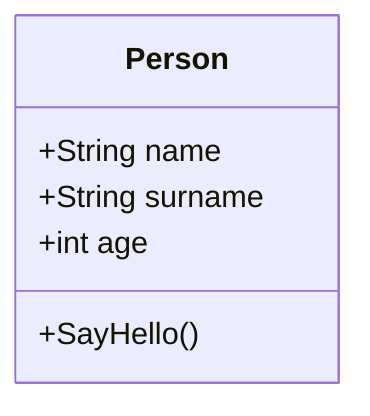
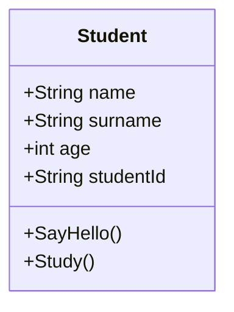
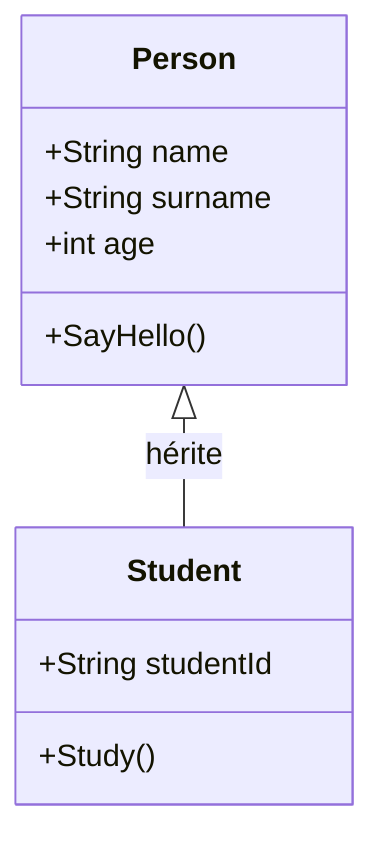

# La programmation orientée objet
___


---

## Intro
___

<br />

Nous allons entrer maintenant un peu plus dans le sujet, et attaquer une des épines dorsales de la programmation moderne: 

La programmation orientée-objet.

<br />

Reprenons et analysons l’exemple en Python utilisé dans le cours précédent:

<br />

``` py {*|1-10|12-15}
class Person:
    # Constructeur : définit l'état initial
    def __init__(self, name: str, age: int): # appelé à la création de l'object
        # En python, on définit ici les variables de l'objet 
        self.name = name  # Attribut (État)
        self.age = age  # Attribut (État)

    # Méthodes (Comportement)
    def sayHello(self): 
        return f"Hello, I'm {self.name}."

# --- Programme principal ---
person1 = Person("Alice", 30)   # Création/Instanciation du modèle
message = person1.sayHello()    # Appel du comportement sur l'objet
print(message)                  # Utilisation de l'objet dans la logique principale
```

---

### Utilisation
___

<br />

Idéalement on aurait pu mettre la classe dans un fichier séparé, et importer celle-ci dans notre programme.

(mais je l’avais regroupé en un block pour l’exemple)

<br />

Voici l’adaptation du programme seul, j’ai profité de l’occasion pour instancier (créer) une deuxième personne:

<br />

``` py {1|3-6|8-11}
from person_class import *      # on importe la classe dans le programme.

# --- Programme principal ---
person1 = Person("Alice", 30)   # Création/Instanciation du modèle
message = person1.sayHello()    # Appel du comportement sur l'objet
print(message)                  # Utilisation de l'objet dans la logique principale

person2 = Person("Martin", 26)  # Création d'un 2eme objet
message = person2.sayHello()    # Appel de la méthode et on stocke le résultat
print(message)                  # On affiche
```

---

## Les classes
___

### Les champs
___

<br />

La définition d’un classe permet de décrire comment représenter notre objet, et ses fonctionnalités.

<br />

``` py {*|4-6|8-10}
class Person:
    # Constructeur : définit l'état initial
    def __init__(self, name: str, age: int): # appelé à la création de l'object
        # En python, on définit ici les variables de l'objet 
        self.name = name  # Attribut (État)
        self.age = age  # Attribut (État)

    # Méthodes (Comportement)
    def sayHello(self): 
        return f"Hello, I'm {self.name}."
```

<br />

Dans cette classe nous allons avoir des champs.

Chaque champ peut être une variable (ou propriété), ou une méthode.

<br />

Il n’y a pas de limites de champs, maintenant si on créé une classe avec des dixaines de variables, et qu’on crée des milliers d’instances (objets) de cette classe, il faut s’attendre à avoir une consommation de mémoire relativement élevée… 

<br />

--- 

### Le constructeur (et destructeur)
___

<br />

Cette classe peut aussi contenir 1 à 2 méthodes spécifiques; le constructeur, et le destructeur (si applicable, voir managed vs non-managed) de la classe.
Ces deux méthodes, propres aux langages utilisés, permettent de personnaliser l’initialisation et la destruction de  votre objet, en fonction de ce que vous jugerez utile.

<br />

``` py {*|1-2}
    # Constructeur : définit l'état initial, en initialisant les variables
    def __init__(self, name: str, surname: str, age: int): # Méthode appelée à la création de l'object
        # En python, on définit ici les variables de l'objet 
        self.name = name  # Attribut (État)
        self.age = age  # Attribut (État)

    # Destructeur (si applicable)
```

---
layout: two-cols
---

### Exemple de class en C#
___

::left::

<br />

``` c# 
public class Person
{
    // Déclaration des variables de la classe
    public string name;
    public int age;

    // Constructeur
    public Person(string name, int age)
    {
        this.name = name;
        this.age = age;
    }

    // Méthode
    public string SayHello()
    {
        return $"Hi, I'm {name} ";
    }
}
```
<br />

::right::

### Et son programme:
___

<br />

``` c#
using ConsoleApp1;
// Type fort
// + utilisation du mot clé new pour appeler le constructeur
Person person1 = new Person("Alice", 30);
string message = person1.SayHello();
Console.WriteLine(message);
```

---

### En visual-scripting (Blueprint)
___

<br />

#### La classe (Actor)
___

<div style="display: flex; justify-content: center; ">

 

</div>

---

#### Le "programme" qui utilise l'actor
___

<br />

<div style="display: flex; justify-content: center; ">

 

</div>

---

## L’encapsulation
___

<br />

Avant d’aller plus loin, il devient important  d’évoquer un des autres grands principes de la POO, l’encapsulation.

<br />

Le fait que les données et les fonctions soient regroupées au même endroit via votre classe vous donne l’occasion de sécuriser (filtrer) l’accès à son contenu, et de choisir exactement ce qui sera accessible et ce qui ne le sera pas.

<br />

=> Cela permet de séparer les détails et processing interne, de la façade visible et exploitable de l’extérieur, ce qui facilite l’utilisation.

(Cela donne un sorte d’effet boite noire vis à vis du fonctionnement interne de l’objet)

<br />

Pour cela, on utilise des modificateurs d'accessibilité, dont notamment :
- public: 		Accessible partout (pas de restrictions)
- internal:		Accessible uniquement dans le projet / assembly
- protected: 	Accessible uniquement dans la classe ou ses dérivés/enfants (souvent le meilleur compromis sécurité/scalabilité)
- private:		Accessible uniquement dans la classe (le plus restrictif)

<br />

Note: il y avait déjà des modifiers public dans l’exemple c# précédent…

---

### Exemple
___

<br />

#### En python:
___

<br />

``` py {1|2|3|4|0}
 self.surname = surname     # ne rien mettre devant la variable la rend public 
 self._surname = surname     # ajouter _ devant la variable la rend protected 
 self.__surname = surname    # ajouter __ devant la variable la rend private
  def _sayHello(self):		#mais cela fonctionne aussi avec les méthodes…
```

<br />

#### En c#:
___

<br />

``` csharp {1|2|3|4}
public string surname;
protected string _surname;
private string _surname;
protected string SayHello() {}
```

---

#### En Blueprint:
___

<br />

<div style="display: flex; justify-content: center; ">

 
  

</div>

<br />

---

### Les propriétés
___

<br />

Maintenant que nous avons vu le principe de l’encapsulation, nous pouvons parler des propriétés.

<br />

L’idée ici est de ne plus exposer directer certaines variables à l’extérieur, mais de plutôt rendre accessible une propriété qui pointe vers cette variable.

Dès lors, il nous est possible d’avoir un réglage fin sur le contrôle donné sur notre variable de l’extérieur, tout comme il est possible d'ajouter de la logique supplémentaire. 

(Particulièrement de la logique de validation)

<br />

#### Exemple python:
___

<br />

``` py
    ...
        self.__surname = surname    # ajouter __ devant la variable la rend private

    @property
    def surname(self):                  # GETTER
        return self.__surname           # Lit et renvoi la valeur

    @surname.setter
    def surname(self, new_surname):     # SETTER
        self.__surname = new_surname    # Ecrit dans la valeur
```

---

#### Résumé
___

- On peut protéger l'accès à une variable avec les modificateurs d'accès (public, protected, private, etc..)"

- On peut ajouter un accès en lecture à une variable avec une propriété, en particulier avec son GETTER.

- On peut ajouter un accès en écriture à une variable avec une propriété, en particulier avec son SETTER.

- On peut ajouter de la logique dans le Getter et le Setter, parce que ce sont des méthodes.

<br />

#### Ajout d'une étape de validation
___

<br />

``` py
    @surname.setter
    def surname(self, new_surname):
        if new_surname is not None:     # Validation avant action
            self.__surname = new_surname
        else
            print("Error: Surname is empty!") 
```

---

#### Exemple C#:
___

<br />

``` csharp
    private string _surname;            

    public string Surname
    {
        get { return _surname; }                // GETTER
        set                                     // SETTER
        {
            if(string.IsNullOrEmpty(_surname))  // SETTER VALIDATION
            {
                // Debug.
                Console.Write("ERROR: Surname is empty!");
            }
            else
            {
                _surname = value;
            }
        }
    }
```

---

#### En Blueprint:
___

<br />

En Blueprint, cette notion d'encapsulation est moins mise en avant, elle est moins forte.

<br />

Pourtant pour chaque variables, il y a un getter et un setter automatiquement ajouté afin de pouvoir lire et écrire dans la valeur.

Mais vous n'avez pas le contrôle sur leur fonctionnement; 

=> il n'est pas possible de modifier leur logique tel quel, comme on l'a vu précédemment.

<br />


Mais si vous avez besoin de plus de contrôle, 

rien nous vous empêche de créer de veritable Getter et Setter manuellement en utilisant une function.


---

##### Le Getter:
___

<br />

<div style="display: flex; justify-content: center; ">

 

</div>


---

##### Le Setter:
___

<br />

<div style="display: flex; justify-content: center; ">

 

</div>


---

## Héritage
___

<br />

Un des derniers fondements de la POO, est l'héritage.

<br />

Le principe est celui-ci:

Une classe, peut aussi hériter d'une autre classe.

=> **Elle hérite donc de ses membres** (variables, propriétés, méthodes) qui lui sont accessibles.

Vous souvenez-vous de l'encapsulation? Je vous donne un indice: protected! ;)

<br />

Prenons pour exemple notre classe Person.

<div style="display: flex; justify-content: center; ">



</div>

---

Et maintenant, disons que nous voulons représenter des élèves.

<br />

Pour cela nous allons créer la classe Student, parce que même si les élèves sont tous des personnes, les élèves ont aussi des caractèristiques supplémentaires, et il faut les représenter.

L'approche simple aurait été de refaire une classe Student, avec les mêmes membres que Person, et des membres supplémentaires propre aux élèves.

<div style="display: flex; justify-content: center; ">



</div>

---

Mais à la place, quand nous créons Student, nous pouvons indiquer que la classe hérite de Person!

<div style="display: flex; justify-content: center; ">



</div>

---

Maintenant, tout les Student, sont aussi des Person.

(Mais, toutes les Person ne sont évidemment pas des Student...)

<br />

=> Person ici est devenu la classe parent de Student.

=> Student est devenu, une classe enfant de Person.

<br />

On dit aussi que Student "dérive" de Person.

---

### Exemple Python
___

<br />

``` py
from person_class import *

class Student(Person): 
    # On garde les mêmes params pour le constructeur, mais on ajoute student_id
    def __init__(self, name: str, surname: str, age: int, student_id: str): 
        # On appelle le constructeur de base
        Person.__init__(self, name, surname, age)
        self._student_id = student_id

    # Méthodes (Comportement)
    def study(self): 
        return f"(Thinking)"
```

---

### Exemple C#
___

<br />

``` csharp
public class Student : Person
{
    private string _student_id;

    public Student(string name, string surname, int age, string student_id) : base (name, surname, age)
    {
        this._student_id = student_id;
    }

    public string Study()
    {
        return $"(Thinking)";
    }
}
```

---

### Exemple Blueprint
___

<br />

<div style="display: flex; justify-content: center; ">

 

</div>


---

## Polymorphisme
___

<br />

Voici maintenant une dernière caractéristique de la POO:

<br />

Si on reprend tout ce qu'on vient de voir, on peut insister sur quelque chose:

<br />

"Maintenant, tout les Student, sont aussi des Person.

(Mais, toutes les Person ne sont évidemment pas des Student...)"

<br />

=> De ce fait, si nous créons une variable Person, nous pouvons stocker un Student dedans.

=> A l'inverse, si nous créons une variable Student, nous ne pouvons pas mettre une Person dedans.

<br />

Par contre, si on reprend notre premier exemple, notre variable Person (qui contient un student)...

Nous pouvons retransformer son contenu par la suite, et avoir dès lors accès aux membres spécifiques de student.

<br />

C'est le polymorphisme.


---

### Exemple C#
___

<br />

``` csharp
// On crée une variable de type Person
Person person2;
// On crée un Student, mais on le stock dans person2
person2 = new Student("Martin", "Franck", 26, "2");
...
// On cast person2 en Student, on peut dès lors acceder à ses membres
((Student)person2).Study();
```

---

### Exemple Blueprint
___

<br />

<div style="display: flex; justify-content: center; ">

 

</div>
